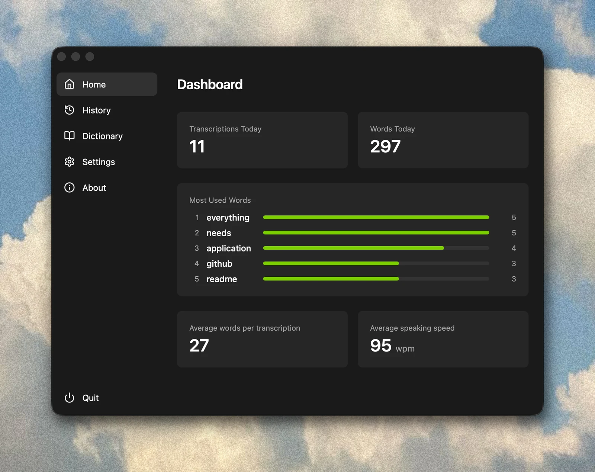

# Fing

**Private dictation for every app.**

Hold your hotkey, speak, release — transcribed text is pasted instantly. Your voice never leaves your device.

## Why Fing

- **Private & offline** — runs [Whisper](https://github.com/ggerganov/whisper.cpp) entirely on-device, with no cloud processing or telemetry
- **Fast** — GPU-accelerated with Metal on macOS and Vulkan on Windows
- **Lightweight** — built with Rust, Tauri, and a minimal TypeScript frontend
- **Free & open source** — no subscriptions or accounts
- **Cross-platform** — built and tested for macOS and Windows

## Features

- **Tray app** — Lives in system tray, stays out of your way
- **Multi-language transcription** — [99 languages](./src/lib/languages.ts) with auto-detection
- **Localized UI** — Available in English and German
- **Custom hotkey** — Bind any key or modifier combination
- **Dictionary** — Add custom words to improve recognition
- **Local history** — Optional transcripts that are searchable and auto-cleared after 30 days
- **Copy & reuse** — One-click copy of any previous transcription
- **Sound feedback** — Optional audio cue when recording starts
- **Auto-start** — Optional auto-launch on login

## Requirements

- 64-bit Windows 10 or later
- macOS 11.0 Big Sur or later (Intel and Apple Silicon)

## Download

- **[macOS (Universal)](https://github.com/jamdaniels/fing/releases/download/v1.1.1/Fing_1.1.1_universal.dmg)** — signed and notarized, open the DMG and move Fing to Applications
- **[Windows](https://github.com/jamdaniels/fing/releases/download/v1.1.1/Fing_1.1.1_x64-setup.exe)** — if SmartScreen warns you, click "More info" then "Run anyway"

## License

MIT
