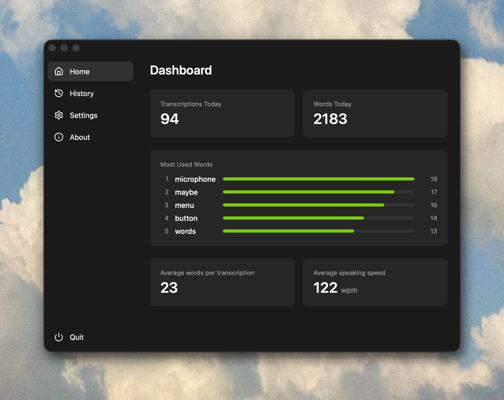

# Fing

**Talk to type. Locally.**

Hold your hotkey, speak, release — transcribed text is pasted instantly. Your voice never leaves your device.

## Why Fing

- **100% local** — runs [Whisper](https://github.com/ggerganov/whisper.cpp) on-device, zero cloud
- **Free & open source** — no subscriptions, no accounts
- **Lightweight** — minimal footprint, GPU-accelerated (Metal/Vulkan)
- **Privacy-first** — no telemetry, mic only active while holding hotkey

## Features

- **Tray app** — Lives in system tray, stays out of your way
- **Multi-language** — English, German, Spanish, French with auto-detection
- **Custom hotkey** — Bind any key or modifier combination
- **Dictionary** — Add custom words and short phrases to improve recognition
- **Optional local history** — Transcripts are searchable and auto-cleared after 30 days
- **Copy & reuse** — One-click copy of any previous transcription
- **Sound feedback** — Optional audio cues for start
- **Auto-start** — Launch on login
- **Usage stats** — Dashboard with word counts, speaking speed, most used words

## Platforms

macOS and Windows.

## License

MIT
